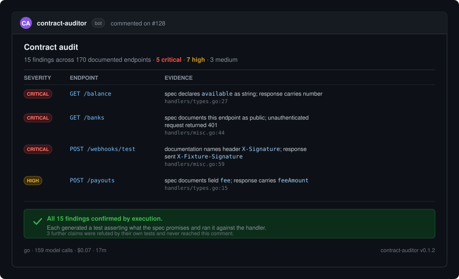

<p align="center">
  
</p>

# Contract Auditor

**micro1 Agentic Workflows Hackathon**

When a company lets other developers use its software, it publishes API
documentation describing what each request will do and what will come back. Other
teams read that documentation and write their code against it.

The trouble is that the documentation and the code get edited by different people
at different times, and nothing checks that the two still agree. When they drift
apart, nobody finds out until an outside developer has built something against a
promise the software no longer keeps.

This tool reads both, finds every place they disagree, and then proves each one by
writing a small test and running it. If the test passes, the software was keeping
its promise after all, and the finding is thrown away before anyone sees it.

Nothing reaches the report unproven. Everything else in the design follows from
that.

The findings in the image above are real output from the evaluation in this
repository, not a mockup. Three further claims were refuted by their own tests and
never appeared.

---

## Which languages it works with

The tool has to read your code to do its job, so it needs to understand the
language you wrote the software in. Four are supported today.

A language only counts as supported once it has a complete test setup of its own:
a small sample application, a set of deliberately introduced faults, and a scored
run showing the tool finds them. So the numbers below are measured. Running
`make languages` prints the same table straight from the code.

Everything here comes from the part of the tool that uses no AI at all. It costs
nothing, needs no account, and finishes in under a second:

| Language | Faults it finds without AI | Of what it reported, how much was real | Of what was there, how much it found | Combined score |
|---|---|---|---|---|
| **Go** | 9 kinds | 100% | 80% | **0.889** |
| **TypeScript** (Express) | 8 kinds | 100% | 80% | **0.889** |
| **Python** (FastAPI, Flask) | 8 kinds | 100% | 70% | **0.824** |
| **PHP** (Laravel) | 6 kinds | 100% | 70% | **0.824** |

Two things matter in that table. Everything it reported was real, in every
language, with no false alarms. And it never once raised a complaint about the
sample applications we deliberately left correct.

What it misses without AI is the same short list everywhere: a field the code
secretly insists on, a rule quietly relaxed, a default value changed. Those need
someone to read and understand the code rather than just look things up, which is
what the AI part is for.

The tool never runs or installs your application. It only reads the source code.
So a project whose dependencies are not installed can still be checked, which
matters because that is the normal state of a fresh checkout.

## Usage

**Requirements:** Docker.

```bash
docker run --rm --pull=always -v "$PWD:/github/workspace" -w /github/workspace \
  ghcr.io/samso9th/contract-auditor:v1 init
```

`--pull=always` matters: `v1` is a moving tag, and `docker run` otherwise
reuses whatever it already pulled.

That reads your repository and writes `.github/workflows/contract-audit.yml`,
with every value it worked out and a comment saying why. Commit it. From then on
every pull request is audited, and the findings arrive as a comment on it.

There is nothing else to configure. The spec, the source directory, the path
prefix and the middleware that separates your public API from your dashboard are
all worked out by reading the code, which is the part you would otherwise have to
know yourself.

### Running it without Docker

Coming soon. Anyone with the codebase checked out already has one of these:

| Runtime | Planned |
|---|---|
| Node | `npx contract-auditor init` |
| Python | `pipx run contract-auditor init` |
| PHP | `composer exec contract-auditor init` |
| Go | `go run github.com/samso9th/contract-auditor@latest init` |
| Rust | `cargo run contract-auditor init` |

### Everything else

Inputs, excluding routes, adding the AI judgment pass, Slack and Telegram,
memory, and troubleshooting are all covered in the
**[documentation](https://contract-auditor.mintlify.site/)**.

## What is the Problem and Who this is for

Who: Any company that publishes software for other developers to use, and every
developer building against it.

The Problem: The case that prompted this is a payments company. Other financial
companies read its published document, write code to move money through it, and go
live. When the document and the running software disagree, the failure lands in
someone else's business, usually with real money involved.

A published service ends up with three separate descriptions of itself, and
nothing keeps them in step:

1. the code, which is what actually runs;
2. short notes written above the code, which a tool turns into the formal documentation;
3. the human-readable guide that outside developers actually read.

Different people edit each one, at different times. Code review asks whether the
code is correct. It does not ask whether the code still matches what was promised
months ago, so the two drift apart quietly.

The measurements below come from that payments company's own codebase, which has
roughly 324 files of code:

| What we counted | Number | Why it matters |
|---|---|---|
| Requests the software actually answers | 841 | What really exists |
| Requests described in the published document | 170 | What outside developers can see |
| Requests with no description written for them | 500 of 841 (59%) | Invisible to anyone outside the company |
| Descriptions that say only "some object comes back" | 153 of 194 (79%) | Technically present, practically useless |

That first number was counted by the tool itself, not estimated. A crude text
search finds 805, which is both too many and too few: it counts things that only
look like request definitions, and misses 50 real ones written in a shorthand it
cannot recognise. That gap between 805 and 841 is the argument for the whole tool.
An approximate answer and a correct one are not the same answer.

Not all 841 of those are meant to be public. Internal and staff-only functions
are legitimately left undocumented, and working out which ones is part of the job.
But nobody is going to compare 170 descriptions against 841 real ones by hand,
which is why nobody had ever measured the gap.

The cost of this problem is lopsided. It is nearly free to fix on the day someone
introduces it, and expensive once an outside company has built against the wrong
promise. Checking automatically on every change moves the cost back to where it
belongs.

---

## How it works

Three stages. Each hands on only what it is sure of.

```
   your code ─────┐
                  │   1. READ AND COMPARE   (no AI, free, instant)
   the published ─┼──►    Read both. List every disagreement that can
   document       │       be settled just by looking.
                  │
   the written ───┘
   guide                         │
                                 ▼
                     2. ASK THE AI   (one question per request type)
                        Only about what looking cannot settle, and
                        told what stage 1 already found.
                                 │
                                 ▼
                     3. PROVE IT   (the part that matters)
                        Write a small test for every finding, from
                        either stage. Run it. If it passes, the
                        complaint was wrong. Throw it away.
                                 │
                                 ▼
                        report, with proof attached
```

Why it is built this way:

**Do the certain work first, and do it without AI.** Listing which requests a
piece of software answers is something a program can do exactly, every time.
Using AI for it would be slower, cost money, and occasionally be wrong. The AI is
saved for what genuinely needs judgement, like reading code and deciding whether
it matches a sentence in a guide.

**Every complaint has to be proved.** This is what makes the tool worth trusting.
AI writes fluently, and a wrong answer looks exactly like a right one, so nothing
is believed just for sounding convincing. Each complaint has to survive a real test
run against the real code. About half of what the AI suggested did not survive, and
was thrown out before anyone saw it.

**Ask about one request at a time.** Handing over a whole codebase and asking
"what is wrong here" gets vague answers. One request, with its documentation
beside it, gets specific ones.

**Remember what was already settled.** Some differences are deliberate. Those get
recorded once and stop being raised, so the report stays worth reading instead of
turning into a list people learn to scroll past.

---

## How it gets better the more it is used

Most tools of this kind never find out whether they were right. This one does, on
every single complaint, because each complaint is settled by a test that either
fails or passes. So every run produces two things: a report, and a record of which
of its own complaints held up.

This is an optional layer, exactly like the AI stage and the alerts. It is off
until you point it at storage you own, and **nothing is ever kept in your
repository or inside the published image**. There is no shared memory, no
history bundled with the tool, and no way for one project's statistics to end up
as another project's assumptions.

Turning it on is the three `memory-*` inputs documented at our
[docs](https://contract-auditor.mintlify.site/). Any
S3-compatible bucket works (AWS,
Cloudflare R2, MinIO, Backblaze, Spaces), and so does a plain HTTPS endpoint,
Cloudinary, or IPFS through a pinning service. Leave `memory-url` out and the
tool behaves exactly as it always has.

What gets stored is one line per complaint, with the verdict its test returned.
The disproved ones are the valuable half: a complaint that was tested and found
wrong is a labelled mistake, and labelled mistakes are what most tools never
collect.

The next run uses them like this. Before checking an endpoint, it looks up the most
similar past mistakes and reads them first, along with the test that disproved each
one. It keeps a running score of how often each type of complaint turns out to be
real, and uses that to order the report and decide where to spend effort. When the
same kind of accepted difference is dismissed three times, it gets written out as a
rule in plain English with the count of evidence behind it, which a person can read
and overrule.

One line governs all of it: **memory changes what the tool looks at, never what
it is allowed to report.** History can move a finding down the page or warn the
model that something like it was wrong before. It can never delete a complaint.
If the test still fails, the problem is real, and last month's statistics do not
get a vote.

That rule exists because of a specific way these systems go bad. Teach a tool to
stop raising a kind of complaint, and it stops producing evidence about that kind
of complaint, so nothing ever contradicts the lesson and the blind spot becomes
permanent. The numbers look better the whole time, because the misses are no longer
being counted. Guarding against it is cheap: about one endpoint in twenty is checked
with the memory switched off entirely, purely to keep testing what the memory has
learned to doubt. A rule that starts being contradicted is demoted automatically.

Turning memory on also turns on the verification gate for your repository, since
a complaint with no verdict teaches nothing. That is the same gate the evaluation
uses: a temporary test is written beside your code, run, and deleted. A complaint
its test disproves is dropped; one whose test cannot be built is kept and marked,
never quietly lost.

### The measurements

Run the same 16 cases twice, the second run reading the first run's mistakes:

| | first run | second run |
|---|---|---|
| complaints raised and then disproved | 11 | **0** |
| precision | 1.000 | 1.000 |
| recall | 1.000 | 1.000 |
| cost | $0.076 | $0.074 |

The number that moved is wasted work: the second run stopped raising eleven
complaints it would have had to disprove. Precision could not go up because the
gate was already catching all of them, and recall did not go down, which is the
result that would have sunk the whole idea. `make self-improve` reproduces this.
One pair of runs is a demonstration, not a trend line.

Growing the test set matters as much as the memory. `make harvest` turns real
drift found in a live repository into a new evaluation case, and a false alarm
that survived the test into a new decoy. A tool that improves against a frozen
benchmark is indistinguishable from one that has learned the benchmark.

---

## What already exists

This is not an untouched problem. Plenty of tools work on part of it, and it is
worth being precise about which part, because the differences are large.

| What it is | What it does | Why it does not settle the question |
|---|---|---|
| [oasdiff](https://github.com/oasdiff/oasdiff), [openapi-diff](https://github.com/OpenAPITools/openapi-diff), Optic, Bump.sh | Compare two versions of the published document against each other | Both sides are the document. If the code changed and the document did not, there is nothing to notice |
| [Dredd](https://github.com/apiaryio/dredd), [Schemathesis](https://github.com/schemathesis/schemathesis), Specmatic | Send real requests at a running copy of the software and check the replies against the document | Needs the software running, with its database and dependencies installed. A proposed change arriving as a fresh checkout has none of that |
| [Pact](https://pact.io) | Records what each outside team actually relies on, and checks the software still honours it | Also needs the software running, and only covers what somebody already wrote a test for. Requests nobody uses yet stay invisible, and those are the ones being got wrong |
| [PactFlow](https://pactflow.io/ai/), now SmartBear's Swagger platform | The paid version of Pact. Its newest feature has an AI write the contract tests for you, from the document or from the code | It writes tests to check the software matches the document. And nothing checks the tests the AI wrote. Contract testing comes as part of a per-seat platform, [from about $32 per user per month](https://swagger.io/product/pricing/) and the AI is rationed: ten credits per user per month, thirty on the dearest tier |
| [Speakeasy](https://www.speakeasy.com/blog/openapi-spec-drift-detection), Treblle, Tusk | Watch live traffic and report requests the document never mentioned | Answers after it has shipped and somebody has already called it. Also needs code added to the running service to do the watching |
| [go-apispec](https://github.com/antst/go-apispec), AutoOAS | Read the source code and write a fresh document describing what they found | Produces a second document rather than a comparison. This is the closest relative of our free stage, and pairing one of them with oasdiff would get near it |
| [driftcheck](https://github.com/deichrenner/driftcheck) | Asks an AI whether a code change contradicts anything written in the docs | Nothing checks the AI. Its answer goes straight to a person, which is the exact failure this project is built to remove |

One thing worth saying plainly next to that, since much of the list above is sold
by the seat. The stage that finds most of the faults here uses no AI, so it costs
nothing at all, on any number of repositories, forever. The AI stage is optional and
billed per use through whichever provider's key you already hold: *the entire
16-case evaluation in this repository, 159 model calls, cost 7 cents.* There is no
seat to buy, no monthly ration of runs, and no account holding your results.

That list leaves two gaps, and those two gaps are what this tool fills.

**Nothing reads the code and the document side by side without running
anything.** A survey of drift-detection tools published this year went looking and
concluded the same: no tool compares a published document against source code
without executing that source code. That is why the free stage here can run on a
proposed change, in a checkout with nothing installed, in under a second. Every
tool above either needs two documents, or needs the software up and answering
requests.

**Nothing makes its own findings pay for themselves.** Throwing out false alarms
with a second pass is established practice in security scanning, where the same
problem of noisy reports has been studied for years
([LLM4PFA](https://arxiv.org/abs/2506.10322),
[Datadog](https://www.datadoghq.com/blog/using-llms-to-filter-out-false-positives/),
[QASecClaw](https://arxiv.org/abs/2605.01885)). But those ask a second AI whether
the first one was right, which is a judgement about a judgement. This tool asks the
code instead. Each complaint has to produce a test that runs against the real
handler, and it survives only if that test fails. A finding gets in because it
survived an attempt to disprove it, not because it sounded convincing.

---

## Does it actually work?

Yes, and anyone who clones this can check every number. 16 test cases: twelve real
faults, four pieces of correct code that look like faults. Scored against the
obvious simple approach on the same cases with the same scoring. Overall 1.000
against its 0.219, every real fault found, and zero false alarms against its 107.

[RESULTS.md](RESULTS.md) has the full write-up: every test case, the results table,
the bar we set before running anything, and the build history, meaning every idea
we tried, what it scored, what we abandoned, and what all of it taught us.

---

## Repository layout

| Path | Contents |
|---|---|
| [auditor/](auditor/) | The agent: tools, prompts, orchestration |
| [auditor/notify.py](auditor/notify.py) | Slack/Telegram alerting, gated on verification |
| [auditor/memory/](auditor/memory/) | Retrieval, calibration and learned rules; no ledger ships here (built) |
| [auditor/memory/store.py](auditor/memory/store.py) | Where the ledger lives: S3-compatible, HTTP, Cloudinary, IPFS, or off |
| [eval/harvest.py](eval/harvest.py) | Grows the evaluation set from real runs: field cases and decoys |
| [eval/compare.py](eval/compare.py) | Compares two runs, for the self-improvement demonstration |
| [ddocs/](ddocs/) | Plain-language overview, self-improvement note, GHCR publishing guide |
| [docs/site/](docs/site/) | Public documentation site: quickstart, CI setup, how it works |
| [baseline/](baseline/) | The single-prompt baseline |
| [eval/fixture/](eval/fixture/) | Synthetic Go payments API + its published spec |
| [eval/mutations/](eval/mutations/) | The 16 mutations and their ground truth |
| [auditor/tools/routes.py](auditor/tools/routes.py) | AST route + annotation extraction (built) |
| [auditor/tools/spec.py](auditor/tools/spec.py) | OpenAPI index with `$ref` resolution (built) |
| [auditor/tools/diff.py](auditor/tools/diff.py) | Nine deterministic drift rules (built) |
| [auditor/tools/goroutes/](auditor/tools/goroutes/) | The `go/ast` walker behind them |
| [auditor/run_deterministic.py](auditor/run_deterministic.py) | Scores the no-model layer over all 16 cases |
| [auditor/verify.py](auditor/verify.py) | The verification gate: generates and runs a Go test per claim (built) |
| [eval/inject.py](eval/inject.py) | Builds evaluation cases, verifies each compiles |
| [eval/score.py](eval/score.py) | Scores any run; identical for baseline and agent |
| [eval/oracle.py](eval/oracle.py) | Emits a perfect run, to verify the scorer itself |
| [reports/](reports/) | Run outputs and scored results |
| [action.yml](action.yml) · [Dockerfile](Dockerfile) | The GitHub Action and its image |
| [RESULTS.md](RESULTS.md) | The evaluation and the build history: test cases, scored results, baseline comparison, every iteration |
| [REPRODUCTION.md](REPRODUCTION.md) | Clean-environment setup and exact commands |

## Prior work

The target repository and the synthetic fixture's domain shape come from
existing private work that predates this hackathon. Everything in `auditor/`,
`baseline/`, `eval/` and `reports/` was built for it. No credentials from any
private repository appear here; the fixture is synthetic throughout.
